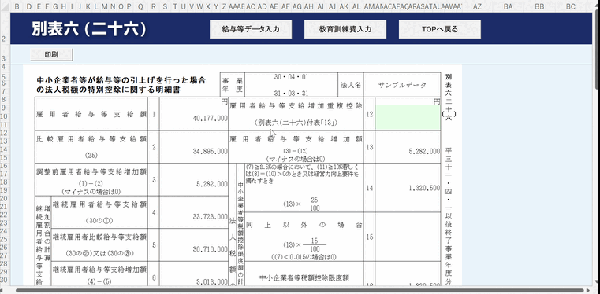
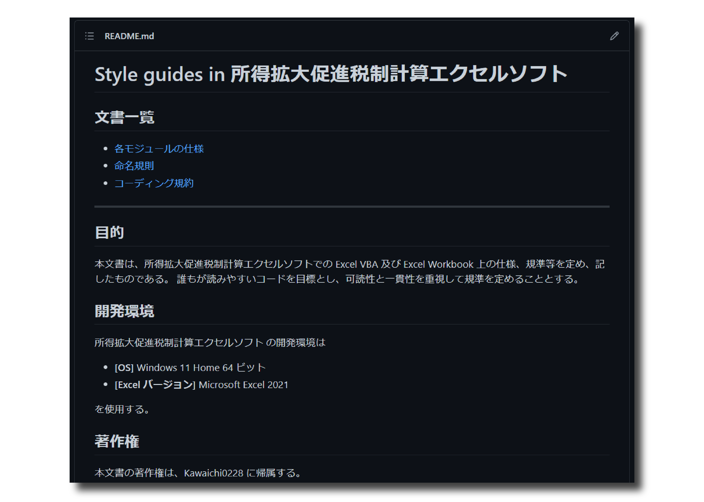
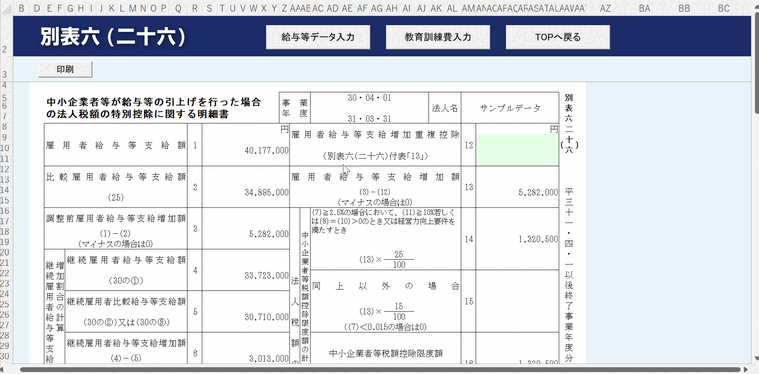
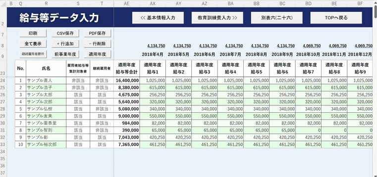
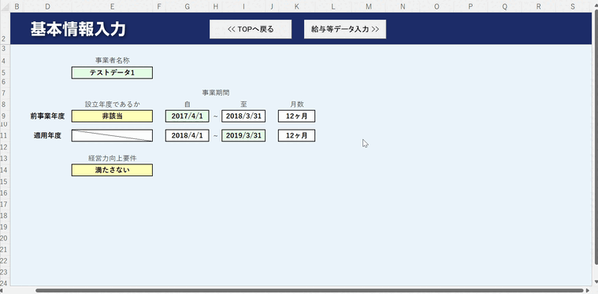
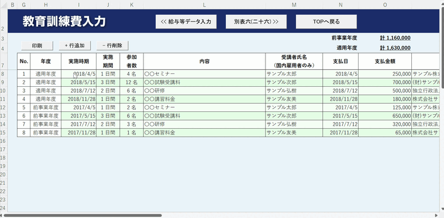
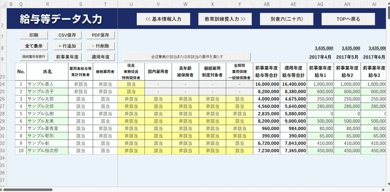
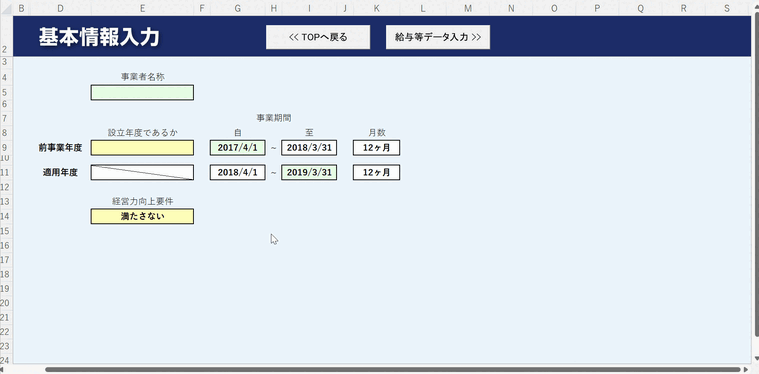

# 所得拡大促進税制計算エクセルソフト

※ 現在、公開停止中

所得拡大促進税制計算エクセルソフトは、法人税を税額控除できる制度としてメジャーである 「所得拡大促進税制」 の計算を、簡単に・スピーディーに行うことができる本格的なエクセルマクロです。

(開発言語: Excel VBA, MySQL 実ステップ数: 5,680)

---

## ウェブサイト

※ 現在、公開停止中

|     |  |
| ------------------------------------------------------- | ---------------------------------------------------------------- |
|  |              |

---

## コーディング規約等

 

[Style guides in 所得拡大促進税制計算エクセルソフト](styleguide/README.md)

markdown を用いて、「コーディング規約」や「命名規則」等を作成しました。

---

## 主要機能

### 税務書類の出力機能(自動計算)

複雑な税金の計算を、各シートに定められたフィールドへ入力することで、簡単に自動計算できるようにしました。また、計算した結果を税務書類様式へ反映させ、それを印刷できるように実装しました。

### 明細データを印刷・CSV・PDF の 3 種類の中から選択し、出力できる機能

ユーザが入力した各従業員の給与等データを明細として出力できる機能を実装しました。出力タイプは印刷、CSV、PDF の 3 種類から選ぶことができます。

### データベース機能(MySQL)

MySQL へ接続(ADODB 使用)し、ExcelVBA からデータベースを操作できるライブラリを自作しました。また、データベース上に登録されたデータを表示し、選択した事業者のデータを各入力フィールドへインポートできる機能を実装しました。(※ユーザ提供版へは未実装)

---

## 補助機能

### テーブルの行追加・削除

テーブルの行を追加及び削除できる機能を実装しました。追加(削除)時に、一時的にシートの保護を解除することで実現させています。また、テーブル全体の各行ごとに色を分け(条件付き書式を使用)、見やすさを向上させました。

### 各入力列を用途のグループごとに表示切り替え

必要な情報だけを見やすく、かつ入力しやすいように、ボタンを押すことで、グループごとの列の表示・非表示を切り替えできるようにしました。

### バリデーション機能

任意のタイミングでユーザが入力した値をチェックし、正しい値でなければエラーメッセージを表示するバリデーション機能を実装しました。

- 出力処理の実行時
- セルの入力時(コピー&ペーストを含む)

### 入力フィールド初期化機能

ユーザが入力可能なフィールドを全て初期化できる機能を実装しました。(※ユーザ提供版へは未実装)

---

## 著作権

全て Kawaichi0228 に帰属する。